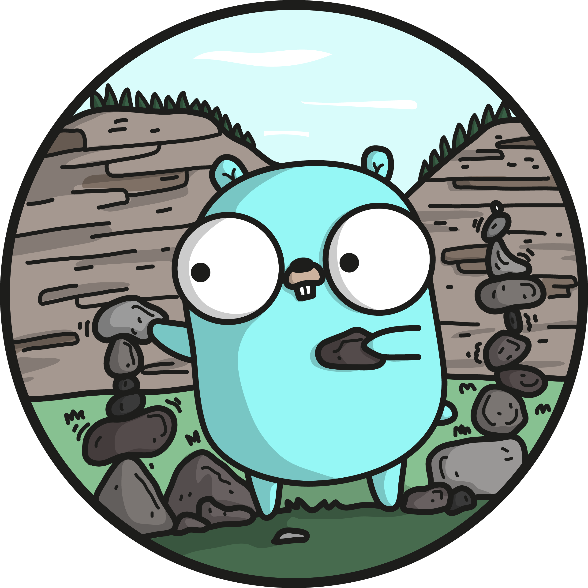

# Las-tools

This is a personal project. The site is some web based tools to extend a user's experience with Last.fm and Spotify. There is features for porting a user's top songs from Last.fm to Spotify and creating a collage from a user's top albums on Last.fm. Some of the code I wrote in this project was ported to my other repo [go-rainbow-collage](https://github.com/conorbros/go-rainbow-collage). I started this project with the goal is being faster and more reliable than other websites offering this functionality and I managed to achieve that. My application can generate bigger collages in under a quarter of the time that other sites take to do this.

## Running the project

### Docker

If you don't have Go installed, running with docker is probably the easiest way to run it locally. There is a script in the `scripts` folder called `run_docker.sh`. That is all that is needed to run it with Docker. You can then navigation to `localhost:8080` in your browser to use the application.

### Go

If you want to run the application locally with Go you must first [install Go](https://golang.org/doc/install). After that is complete, clone the repo to your `goroot` and run `go mod download` in the project directory. Then `go run main.go` which will start the application and it can be viewed at `localhost:8080` in the browser.

